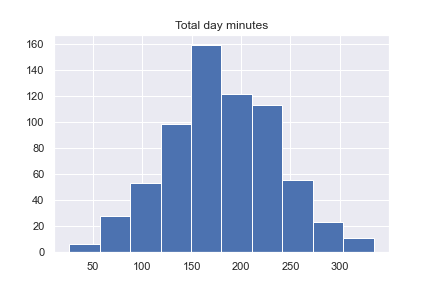
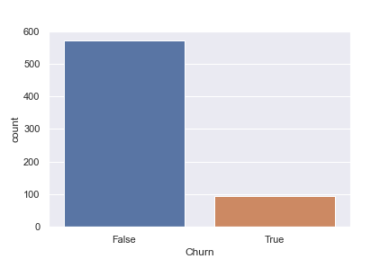
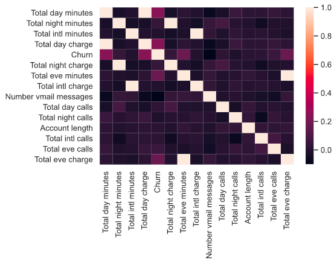
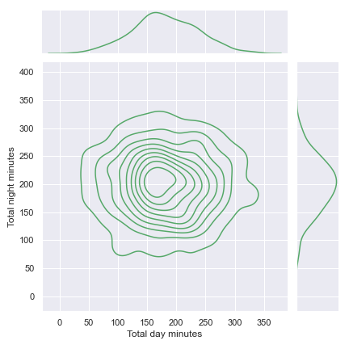
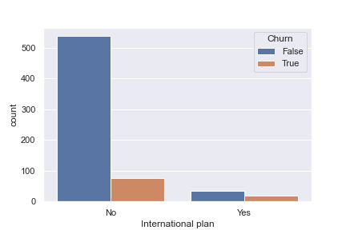
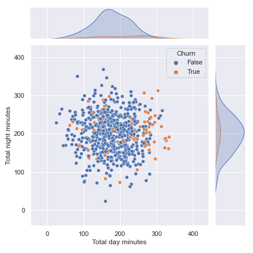

# Handout - End-to-end Machine Learning

### Por Caio Emmanuel e Diego Saragoza

---

Bem-vindo, pythonistas!

Sabemos que o semestre está perto de acabar, mas ainda falta dar aquele último gás para fazer um trabalho fera de Ciência de Dados!

A gente sabe que você tá perdido. A gente sabe. E pra te ajudar e tornar seu semestre mais tranquilo, a gente resolveu fazer esse handout pra te passar umas dicas de como fazer. As partes são independentes, então você pode aprender na ordem que quiser. Vamos começar...

---

### Sumário

1. [Análise Exploratória](#1-análise-exploratória)
2. [Modelo](#2-modelo)
3. [Métricas](#3-métricas)

---

### 1. Análise Exploratória

O foco aqui não é te ensinar ou fazer uma revisão daquela análise exploratória que você aprende lááááá no começo com aqueles tutoriais de pandas, não!

Se você quer fazer um trabalho impressionante de dados, seja na faculdade ou no trabalho, você deve saber contar uma história com seus dados e a linguagem para contar essa história é uma boa análise exploratória, carregada de gráficos que empoderem os seus argumentos.

Todo bom trabalho deve começar (e dedicar algumas horas a isso) com uma EDA (Exploratory Data Analysis), em verdade, se feito corretamente a EDA serve como uma validação de que uma base de dados pode realmente ser útil para um modelo, ainda que as métricas pareçam dizer o contrário.

Como diria o filósofo estóico Sêneca:

> O Homem sábio considera a razão de todas suas ações, mas não os resultados.

Mas chega de enrolação!

Escolher o que você quer demonstrar é um passo essencial para sabermos qual o melhor gráfico a fazer. Uma regra de bolso boa a se seguir é essa usada pelo Kaggle:


Vejamos alguns exemplos de uso. O dataset utilizado aqui é o <i>"Orange Telecom's Churn Dataset"</i>, um dataset utilizado para prever a saída de clientes de seus planos telefônicos. Comece lendo esse esse arquivo como um dataframe, você pode ver o nome dele na aba "Files" do cabeçalho.

Façamos um estudo das features quantitativas. Se plotarmos a feature <i>Total Day Minutes</i>, obteremos a seguinte distribuição (pode ser utilizando o método ```.hist()``` do dataframe por agora):



Agora é sua vez, descubra quais são todas as variáveis quantitativas e plot em uma única imagem (como subplots) a distribuição destas. <b>Não faça isso plotando uma por vez!</b> Pense na maneira mais ágil de fazê-lo. Você pode conferir as imagens geradas na aba "Variables".

Pra isso você deve usar o [distplot](https://seaborn.pydata.org/generated/seaborn.distplot.html) do seaborn, pesquise como ele funciona e aplique para todas as variáveis quantitativas.

---

Para estudarmos as variáveis categóricas, como o próprio <i>churn</i>, é conveniente sabermos como esse está distribuído entre os valores que pode assumir. Mas ao invés de usarmos um ```.value_counts()``` insosso que ficará perdido no seu código, vamos utilizar gráficos!

O tipo de gráfico ideal para realizar essa contagem é o [countplot](https://seaborn.pydata.org/generated/seaborn.countplot.html), para o churn que falávamos vamos ter:



Faça o mesmo para as outras variáveis categóricas.

---

É possível criar gráficos muito significativos quando plotamos features quantitativas por outras features quantitativas. É um exemplo o gráfico de correlação, muito útil para saber de antemão quais podem ser as features mais importantes para a modelagem da solução.

Veja a matriz de correlação abaixo, chamamos isso de heatmap.



Ela foi criada da seguinte maneira, com as variáveis que nos interessava:

```
features = list(
    set(df.columns)
    - set(
        [
            "State",
            "International plan",
            "Voice mail plan",
            "Area code",
            "Customer service calls",
        ]
    )
)

corr_matrix = df[features].corr()
sns.heatmap(corr_matrix)
```

Perceba que essa matriz possui uma simetria em relação a sua diagonal, uma vez que a operação de correlação é simétrica em relação às variáveis. Uma maneira de deixar esse gráfico mais <i>clean</i> é aplicar uma máscara sobre o triângulo superior. Procure como criar essa máscara e aplique ela na matriz de correlação criada.

---

Podemos ainda visualizar a distribuição de uma variável quantitativa por outra utilizando o [joinplot](http://seaborn.pydata.org/generated/seaborn.jointplot.html), veja um exemplo:



Experimente fazer o mesmo para outros pares de variáveis quantitativas, brinque como o parâmetro <i>kde</i> dessa função.

---

Da mesma forma é possível combinar variáveis qualitativas em um mesmo gráfico. Veja alguns exemplos utilizando countplot. Adicionamos o parâmetro <i>hue</i> para adicionar mais uma variável na contagem.



---

Por último, é possível ainda combinar features quantitativas e qualitativas e conseguir gráficos ainda mais significativos.



### 2. Modelo

O objetivo dessa sessão não é explicar todos os modelos que você vai usar no seu projeto final, mas sim mostrar uma estrutura que você pode usar para explicar seus modelos.

O dataset escolhido é excelente para fazer sistemas de classificação, por isso mesmo será um modelo de classificação que usaremos para construir esse template de projeto.

Primeiro de tudo, devemos escolher quais dados serão usados para predizer a variável <i>target (Churn)</i>. <b>Não vou me preocupar em tratar os dados não númericos agora.</b> Portanto, separe o dataset em dois dataframes:

- O DataFrame <b>X</b> que serão os dados usados para prever a <i>target</i> composto pelas variáveis númericas do dataset original;
- A Series <b>y</b> que será a Series da variável <i>target</i>

---

Agora que você fez isto, vamos separar nosso dataset em dados de treino e dados de teste. Para isso, será útil a função [train_test_split](https://scikit-learn.org/stable/modules/generated/sklearn.model_selection.train_test_split.html) do Scikit Learn, procure como usá-la e crie uma divisão entre treino e teste com uma razão de 20% para dados de teste.

Nomeie os arrays de treino como sendo <i>X_train, y_train</i> e os de teste como <i>X_test, y_test</i>.

---

O modelo que usaremos aqui será o <i><b>Decision Tree</b></i>!

Esse algoritmo é bem mais simples e não precisa de nenhuma matemática complexa para entender. O seu nome em si já é bem autoexplicativo. O algoritmo consiste em montar uma árvore binária que imponha, a cada nível da árvore, uma condição sobre a qual dividir os meus dados.

A seguinte imagem representa isso. Pense que você quer decidir para onde sair uma determinada tarde, mas sua decisão depende da resposta a algumas condições:


<b>Entropia</b>

Entropia é uma propriedade dos sistemas associada ao grau de organização destes, quanto maior minha entropia, mais desorganizado é meu sistema. Mas não é preciso ser nenhum mestre em estatística ou teoria da informação para entendermos este conceito. A forma como calculamos essa grandeza é bem simples e é:

<div style="text-align:center">

</div>

Onde  é a entropia do sistema e  é a probabilidade de encontrarmos um elemento pertencente à classe i dentre minhas  amostras. O objetivo da minha árvore de decisão é, a cada nível, reduzir essa entropia, ou seja, aumentar o grau de organização do meu sistema. Sendo assim, o desafio é escolher em que ponto, ou, no nosso caso a partir de qual valor, dividir uma feature de maneira a minimizar essa métrica.

---

Vamos usar um exemplo para explicar melhor:

Imagine que queiramos tomar a decisão sobre qual a cor de uma bola no seguinte grupo e, para isto, vamos realizar múltiplas divisões entre subgrupos de modo que, no fim, possamos determinar a cor de uma bola dado sua posição no meu conjunto (supondo que haja uma relação entre essas variáveis, cor e posição).

O meu grupo é:


Por convenção, consideramos a entropia inicial do sistema como sendo .

Imagine que façamos uma primeira divisão em x = 12 (não precisamos nos preocupar com o ponto onde fazer essa divisão, como dissemos, o algoritmo irá buscar esse ponto visando diminuir a entropia, vamos mostrar apenas o procedimento que ele fará).


Vamos agora calcular a entropia em cada subgrupo.

No grupo da esquerda:

<div style="text-align:center">

</div>

E, no grupo da direita:

<div style="text-align:center">

</div>

Perceba que conseguimos diminuir a entropia em ambos os grupos, mas com isso também diminuímos o número de amostras em cada grupo. Por tanto, é interessante relacionar essa entropia com o número de amostras no meu grupo e fazemos isso através de uma métrica chamada Ganho de Informação, ou IG, da sigla em inglês Information Gain e é dado por:

<div style="text-align:center">

</div>

Onde  é a minha condição pra realizar o cisalhamento,  é o número de amostras em cada subgrupo e  a entropia de cada subgrupo. Para meu sistema, por exemplo:

<div style="text-align:center">

</div>

Daí em diante o meu algoritmo repetirá esse procedimento até reduzir a minha entropia o máximo possível no sistema. Verifique:

<div style="text-align:center">

</div>

---

Okay, agora que explicamos o modelo, vamos aplicá-lo. Utilize a função [DecisionTreeClassifier](https://scikit-learn.org/stable/modules/generated/sklearn.tree.DecisionTreeClassifier.html) do Scikit Learn.

Crie um objeto do tipo <b>DecisionTreeClassifier</b> e treino com os arrays de treino.

Após isso, use o modelo criado para prever um novo array de targets com o array de teste, chame esse de <i>y_pred</i>.

Agora vamos ver como você pode conferir a precisão do seu modelo.

### 3. Métricas

Assim como na sessão anterior, nesta usaremos apenas algumas métricas, pois você <b>deve</b> pesquisar outras métricas que eventualmente precise.

As métricas que mostraremos são as mais simples, mas possuem alguns conceitos importantes que você pode precisar para entender outras métricas.

Para isso, usaremos a função [classification_report](https://scikit-learn.org/stable/modules/generated/sklearn.metrics.classification_report.html) do Scikit Learn. Estude como usá-la e o que ela retorna.

Algumas das métricas importantes contidas nesse relatório são:

#### Precision (precisão)

É dado como a razão entre os <i>true positive</i>, ou verdadeiro positivos, que é o número de elementos de uma classe prevista que você acertou sobre a quantidade de elementos da classe prevista (certos ou errados).

#### Recall

É dado como a razão entre os <i>true positive</i>, ou verdadeiro positivos, que é o número de elementos de uma classe prevista que você acertou sobre a soma dos <i>true positive</i> com os <i>false negative</i>, ou falso negativos.